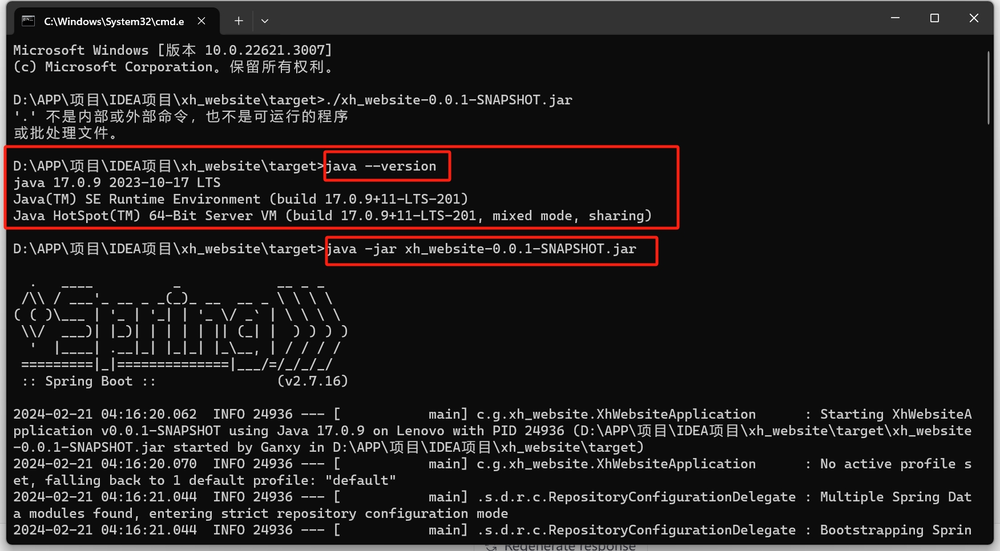

> 欢迎参与本站的更多优化和开发，以下内容适用于本站源文件的说明，在此之前，你应该拥有良好的编程习惯  

_本站是基于个人憧憬围绕学校意见组织运营的门户网站_

## 1. 开始参与
+ 安装Git
+ 安装Node.js和npm
+ 你应该具备一些Git命令的知识
+ 编辑开发工具（建议VSCode）

## 2. 开发
```cmd
git clone https://github.com/Ganxy03/xh_web.git # clone 仓库
npm install # 安装依赖(或yarn，国内用户也可使用 [cnpm](https://cnpmjs.org/))
npm run dev # 启动开发环境，本地访问（http://localhost:40127）
```
在完成开发后，发起 `PR` review 无误后，将合并入主仓库，访问域名：[互联网信息协会](http://xh.ganxy03.cn)。

## 导入数据库
> 找到仓库SQL目录 将xh_web.sql数据库文件导入本地

## 本地运行
> 找到仓库SpringBoot目录
```cmd
先检查java版本:(需大于17)

java --version

进入target目录 执行:
java -jar xh_website-0.0.1-SNAPSHOT.jar

```


> 利用小皮面板 部署vue项目  
找到仓库dist目录