> 欢迎览阅本站用户使用手册，本手册将竭尽所能用图文形象地向您展示功能  
> 您的支持便是我们更新的最大动力  

## 1.个人账号
### 1.1 注册
> 在此之前您应该先注册一个账号

手机、邮箱皆可注册
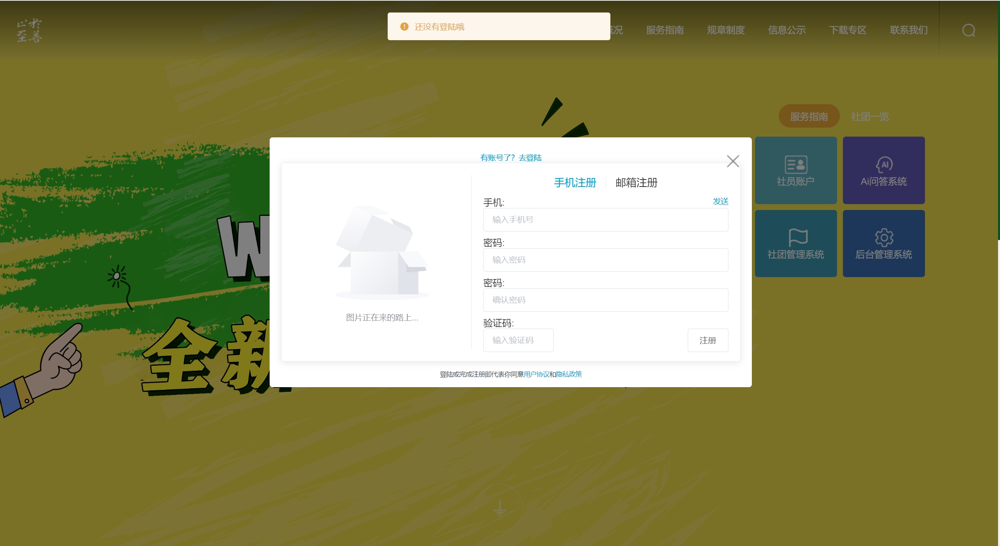
在验证完账号信息后 需要手动输入你的学号  
`注意：`学号一经注册便不可更改
再次确认后 便注册成功
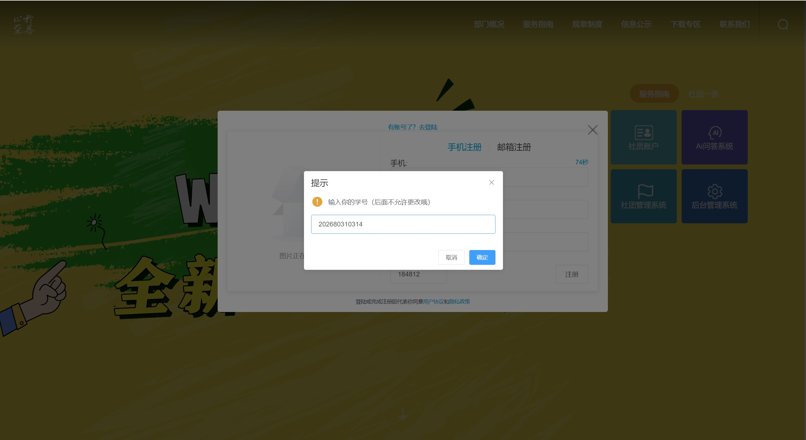

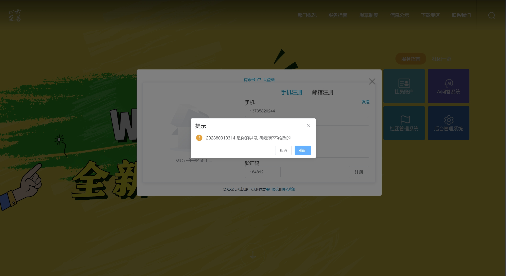

### 1.2 登陆
> 利用学号+密码登陆  
> 暂未开放邮箱登陆和QQ等第三方授权登陆  
> 后续会不断开发

### 1.3 补充个人信息
> 在登入自动跳转后 账号还需获取个人信息作为社团管理和未来其他服务的数据补充  

在此处根据注册使用的邮箱和手机方式不同 皆需要验证另一种联系方式  
验证成功后 便进入步骤二 点击保存即可  
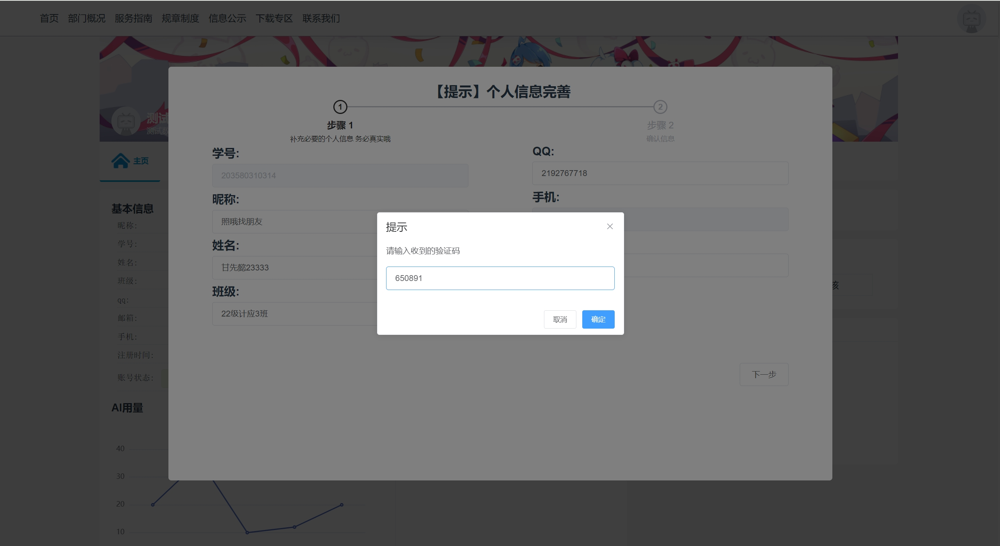
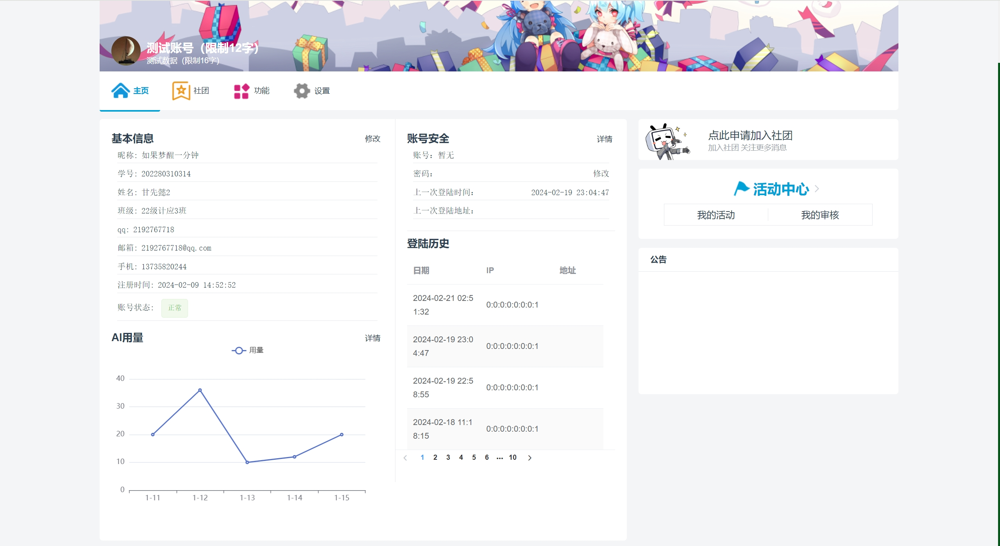
到这里 个人信息就补充完成了

## 2.社团功能

### 2.1 报名
> 点击小菜单 社团 >> 所有社团  
> 点击右箭头 跳转到详情页面  
> 如果你使用电脑 报名按钮在右上角
> 如果你使用手机 报名按钮在右下角
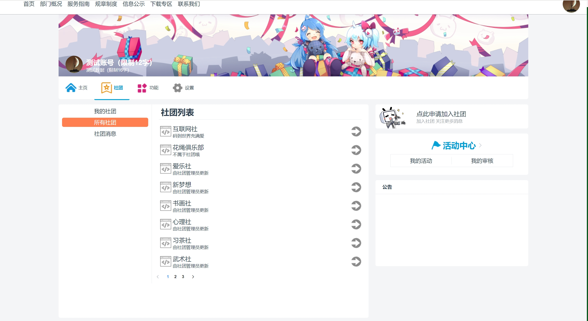
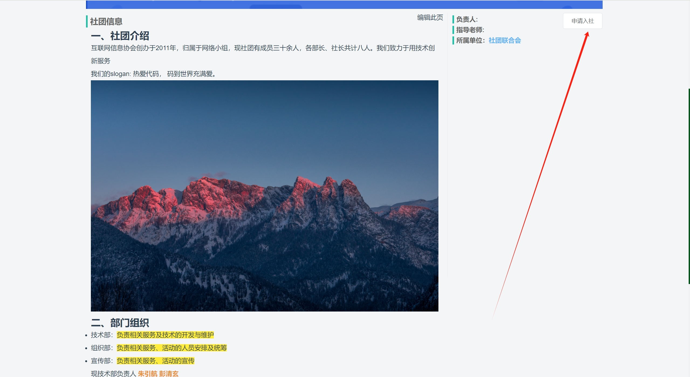

可选择你要加入的部门 写下你的自我介绍 让社团的管理员的审核或许会更快些！
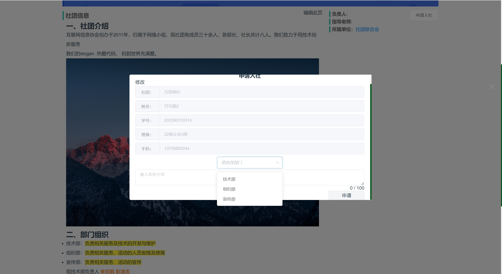
### 2.2 查看进度/查看社团信息
> 回到个人账户 右边的侧边栏的 `我的审核` 可以查看你的审核状态
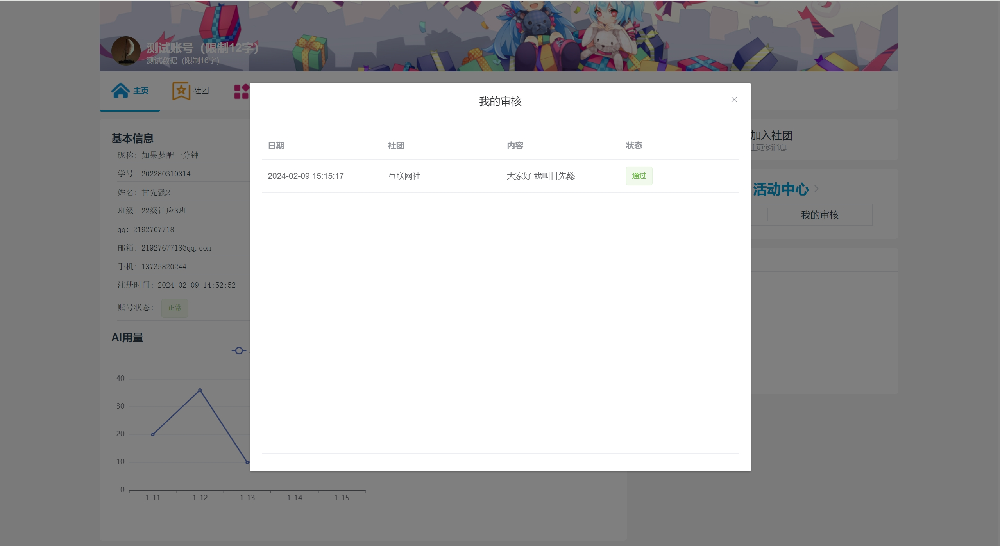
如果好长时间没有过审的话 或许你可以在QQ上催一下你的社长大人

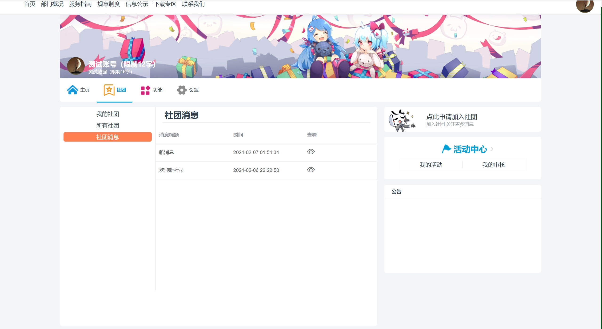
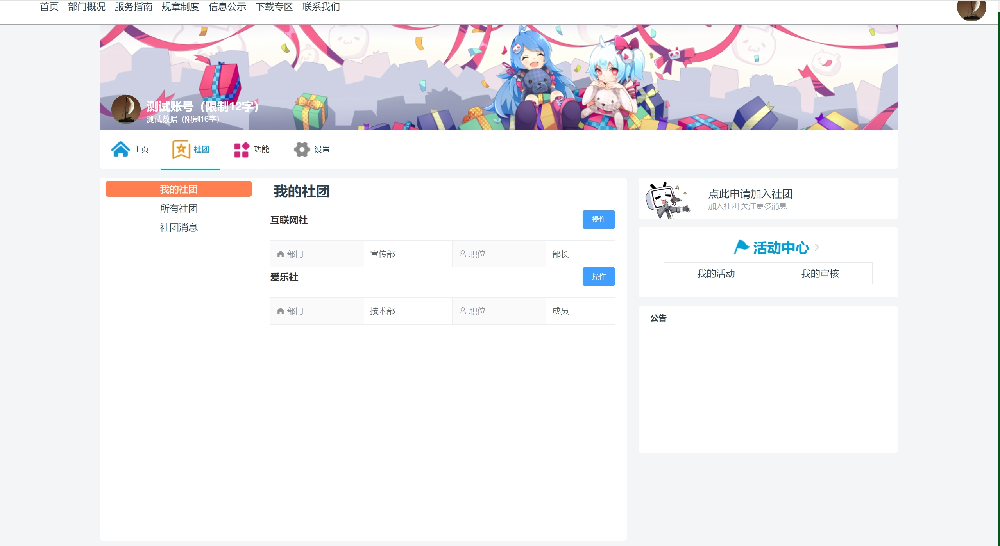

同样的 在`我的社团`可以展示加入的社团信息
`社团消息`里可以查看社团内部发的消息

## 自行探索
> 本站会继续优化界面效果以及交互体验  
> 更多功能还望多多建议