## 1.社团管理

> 首先先从站点管理员获取各自社团的管理账号  
> 可询问社联负责人  

点击主页的社团管理图标入口 便可进入社团管理系统的登陆页面 输入各自社团的账号密码 便可进入各自的社团  
更多可视化数据会慢慢开发 还请先适应简单的界面

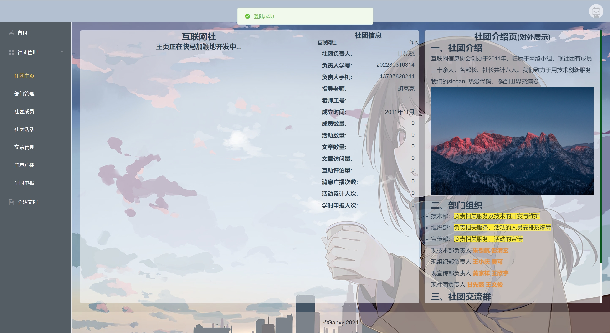
### 1.1 部门管理
> 社员在申请入社可以选择的部门在这里进行创建或者修改  

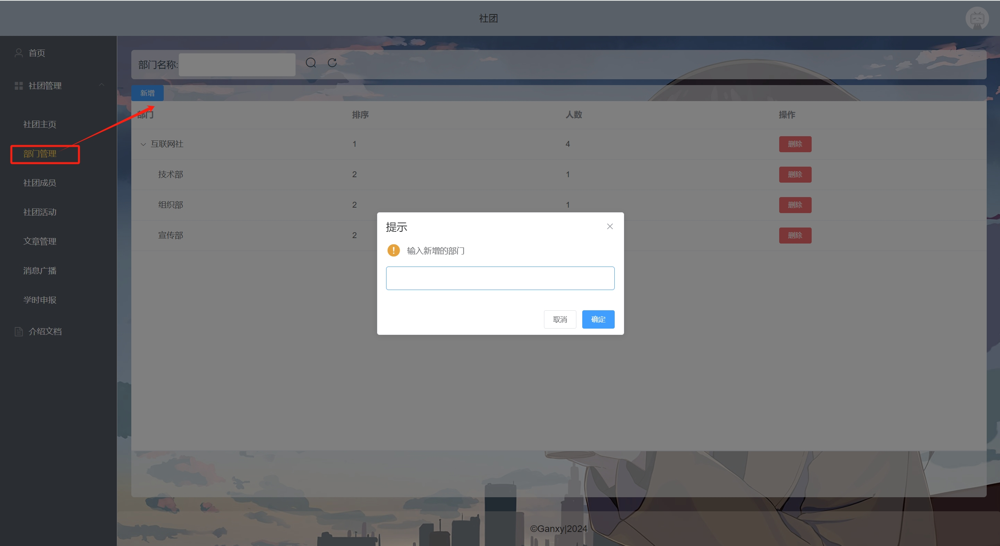
### 1.2 成员管理
> 社员在注册账号后的申请 可在这级菜单栏进行审核  
> 审核后也可对成员身份进行调整

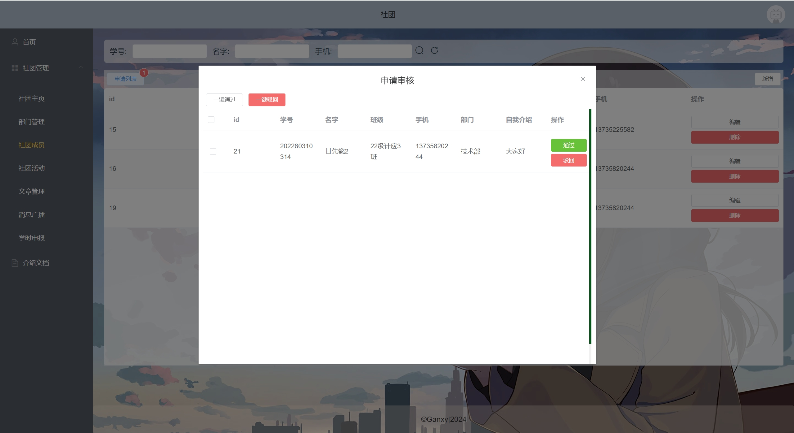
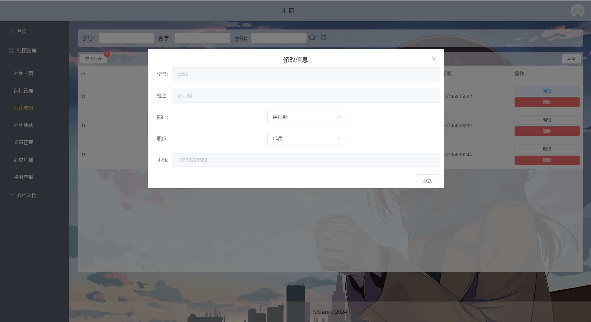
### 1.3 文章管理
> 这级菜单是社团新闻动态文章发布的管理  
> 因为涉及传播 故上加审核 按学校的意见由我社或社联等其他管理人员进行内容审核  
> `注意`该功能目前不完善 暂不实现本地上传媒体资源  
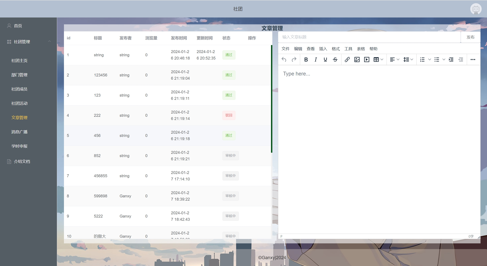
### 1.4 活动管理
> 新建活动 交由社联审批 （建议提前与社联负责人沟通）本站仅作管理 和 数据的记录  
> 活动审批通过过后 社团内的社员便可参加活动  
> 后续的学时、部门的职位竞选 皆可按此参考社员活动参加情况  

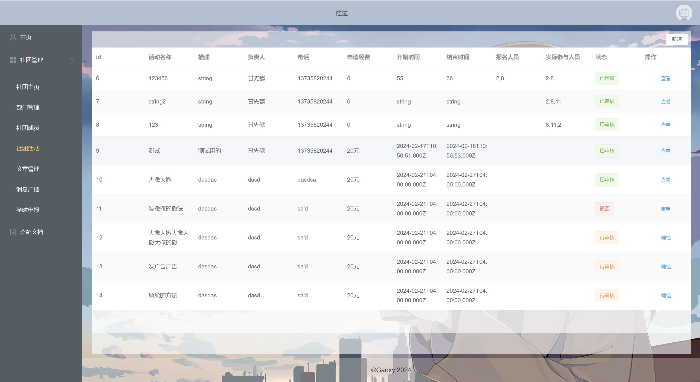
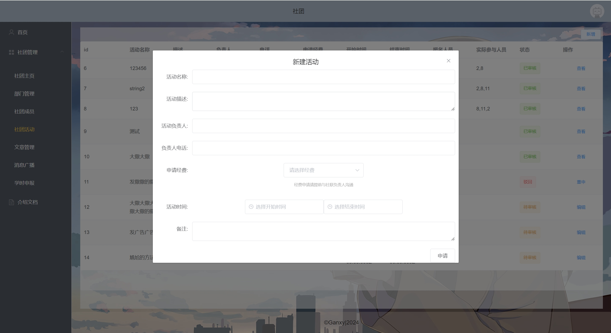
### 1.5 消息广播
> 社团内的站内消息 （本站仅作管理平台 即时消息还请移步QQ、微信等通讯软件）
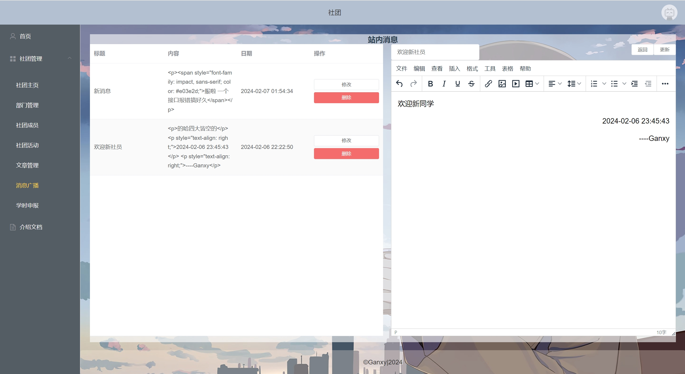
### 1.5 学时申请
> 学时申报由社联管理员创建当前学期的学时项目 各社团管理员在规定的时间内进行各自社团的学时申报
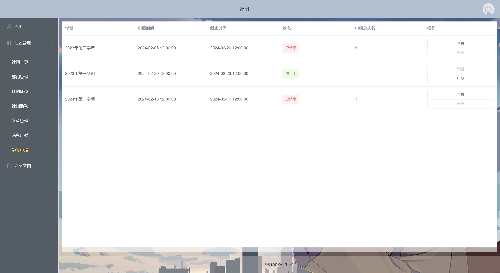
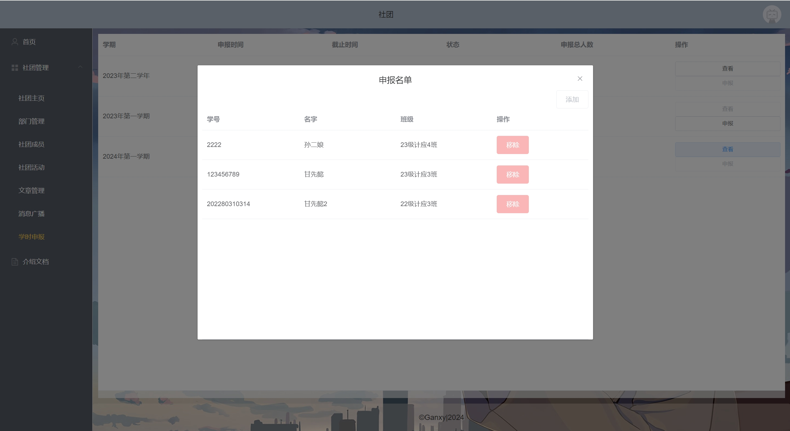
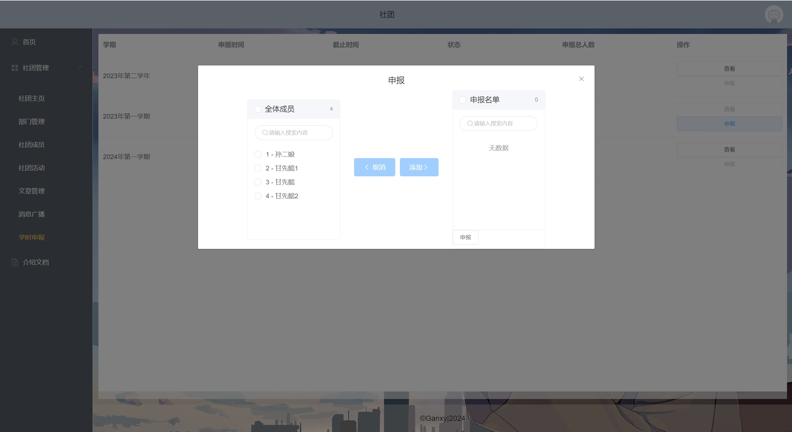

## 2.后台管理

### 2.1 社团管理
> 开发中...
### 2.2 发布管理
> 文章发布前的内容审核  

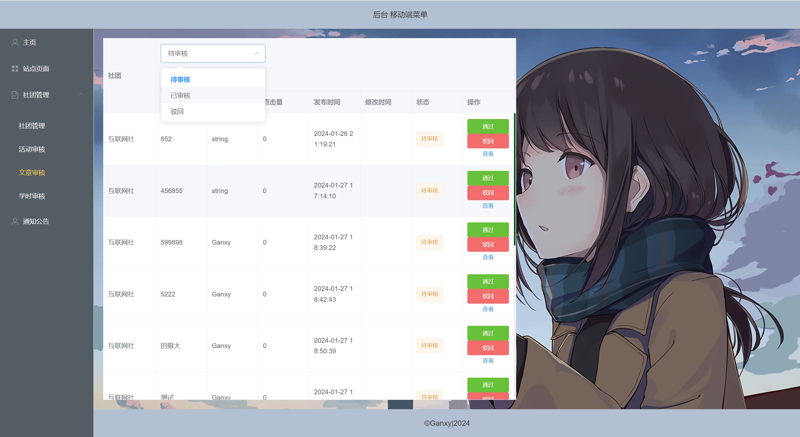
### 2.3 学时审核
> 后面会加一个学时一键生成证明材料的功能  
> 一加水印防伪 
> 二可导打印 让学时证明有迹可查

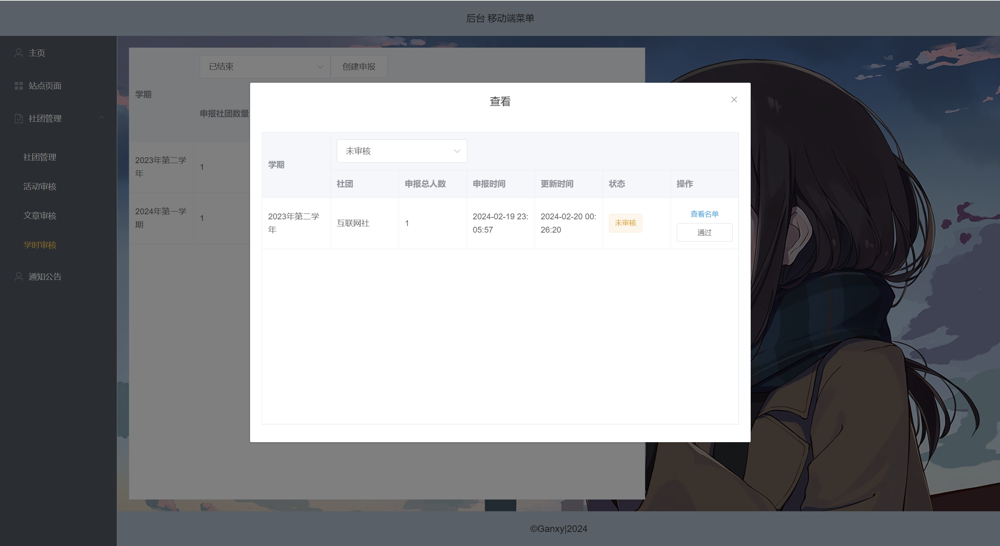
### 2.4 站点管理
> 站点的静态页面管理 略  

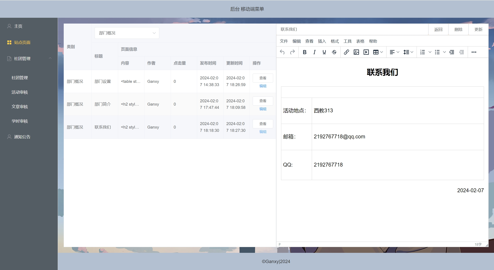